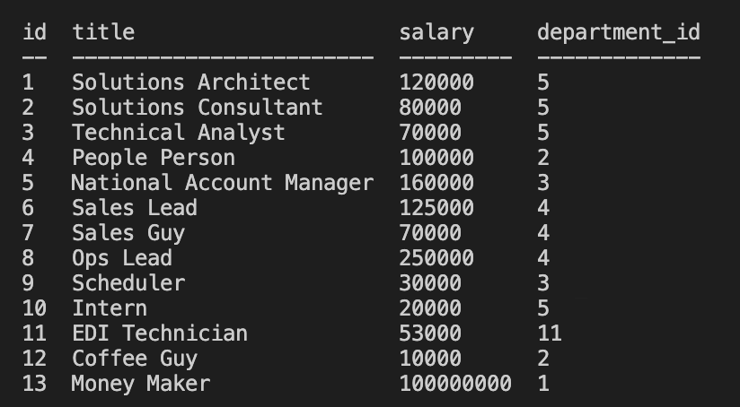
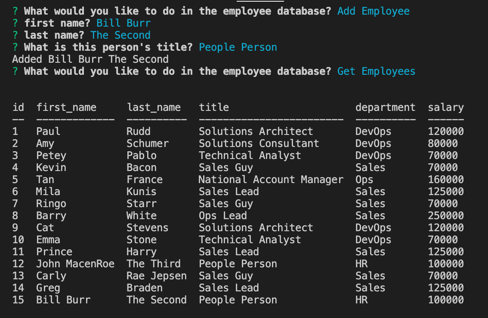
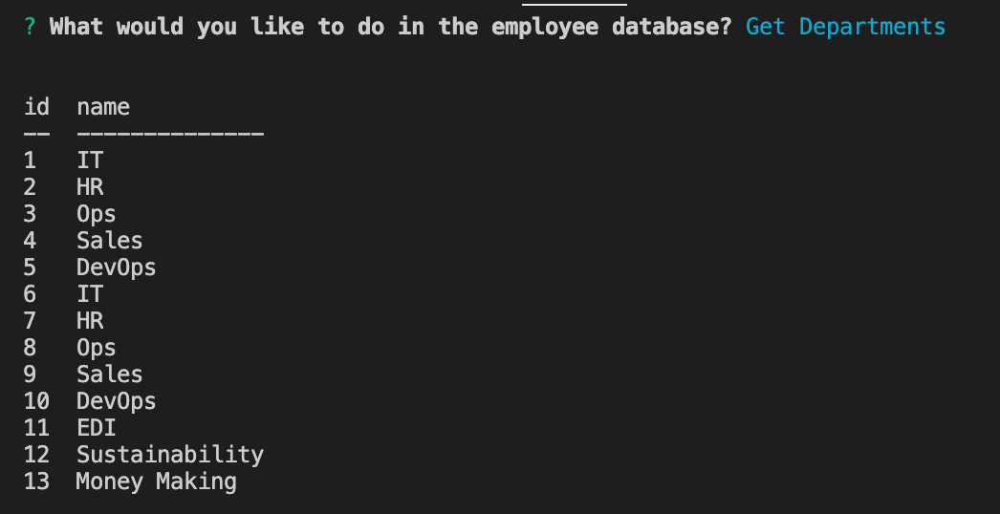

# EmployeeTrackerMySQL

## Table of Contents
* [Description](#description)
* [Installation](#installation)
* [Usage](#usage)
* [License](#license)
* [Contributors](#contributors)
* [Questions](#questions)

## Description
To update and get information from a MySQL Database is often not straightforward. 

This app uses "Inquirer" to prompt the user and guide them step by step in fetching and inputting data to an employee database, so the user can keep track of Employees in an organization as it continues to evolve. 

"console.table" allows the user to see the database info right on the console log so the user doesn't have to switch screens.

## Installation Instructions
One can clone the repository locally, run the sql files (located within the db folder) in MySQL to get information populated, and then using the terminal, change directories into the main folder, and run npm install. 

## Usage Information
Once installed, once can use the app by running the command "node index" while in the main folder in the terminal. 

Here is a YouTube walkthrough [https://youtu.be/0OwNOhLmuZk](https://youtu.be/0OwNOhLmuZk)

## License
MIT

## Contributors
Caroline Twyman

## Questions
Contact me:

Github: [https://github.com/carolinetwyman](https://github.com/carolinetwyman)
Email: [carolinetwyman@gmail.com](carolinetwyman@gmail.com)
